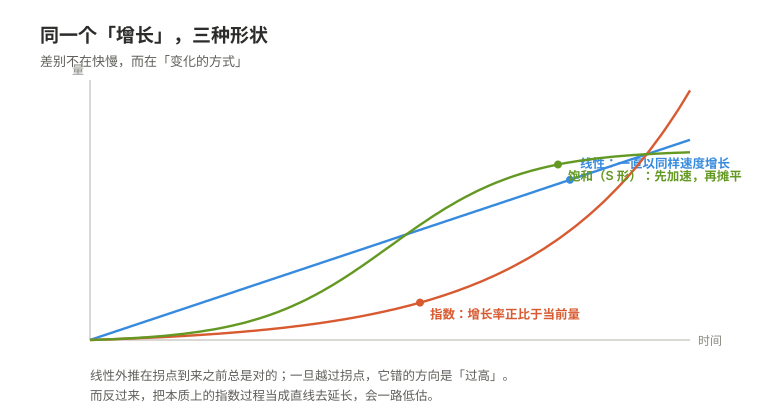

# 01 如何描述世界

> **一句话**：数学不研究事物，它研究关系；把关系从事物里抽出来的那一刻，同一套推理就能用在完全不同的东西上。

---

## 一、为什么值得知道

缺少这套语言的人，通常不是"算不出来"，而是**每一步都算对了，却不知道自己算的是什么**。

下面四个情形，前两个每天都在发生。

---

**情形一：复利——每一步都算对了，结论还是错的（日常）**

一张信用卡写着"年化 18%"。很多人在脑子里把它换算成"每月 1.5%"（18 ÷ 12），然后觉得一年就是 18%。实际按月复利是

> (1 + 0.18/12)¹² − 1 ≈ 19.6%

差的这一点点还不是要害。要害是：**指数增长有一个几乎不变的性质——倍增的时间是常数。** 用"72 法则"估一下，18% 对应的倍增时间约 72/18 = 4 年（精确算约 3.9 年，这里用估算）。这意味着第 4 年长出来的量，等于前 4 年全部的累积；第 8 年长出来的量，等于前 8 年全部的累积。

换成更刺眼的形式：所谓"每天进步 1%"，一年后是 1.01³⁶⁵ ≈ 37.8 倍；"每天退步 1%"，一年后剩 0.99³⁶⁵ ≈ 0.026，约 2.6%。**注意这里用的都是量级估计，不是精确承诺**——真实世界里没有一件事能连着 365 天保持同一个比率。但这正是要说的东西：比率只要长期稳定，结果就由"时间"而不是"努力"主导。

债务、流行病、病毒传播、技能的正反馈、电池的衰减曲线，都在这一条底下。它们的共同点是：**末期看起来"突然"，其实从第一天就被决定了。**

而缺少这个概念的人，不会觉得自己缺什么。因为他每次算的都是"这个月多还多少"，每一步都没错。错的是他把一个乘法过程当成了加法过程。

---

**情形二：平均值掩盖分布（日常，而且几乎每个人都被骗过）**

有十个人，其中一个人收入是另外九个人的 100 倍。平均数会被这一个人拉起来，于是**九个人中的每一个都在"平均线以下"**。这不是统计学花招，这是常态：只要分布是偏斜的，平均数就不代表任何一个人。

体温也是一个例子。说"正常体温 37℃"，并不存在一个体温恰好 37℃ 的"典型的人"；真实的人群是一条分布，而且同一个人一天之内就在波动，早晚差别可以到零点几度。**"37℃"是一个被制造出来的抽象，不是任何一个人。**

这条知识真正的作用不在于会算标准差，而在于一个动作：**看到平均数，先问"它背后是一条什么形状的分布"，再问"有多宽"。**

具体到会吃亏的地方：一条河平均水深一米，你走过去可能会被淹死——因为"平均一米"和最深处可以差一个量级。一份"人均年薪二十万"的招聘海报、一个"平均等待时间 5 分钟"的客服电话、一个"平均治愈率"很高的治疗方案，都在同一个陷阱里：**平均数抹掉的那部分信息，往往正是你要做决定的那部分。**

---

**情形三：线性外推在现实里几乎总是错的**

拿过去五年的增长画一条直线，延长到未来——这是人类最自然的预测方式，也是最容易失败的一种。原因很直接：**现实中的增长几乎都受约束。** 资源有限、市场会饱和、竞争对手会反应、身体会疲劳。于是曲线通常是 S 形的：先是加速，然后减速，最后摊平。

在摊平发生之前，线性外推总是对的；一旦越过了拐点，它就错得越来越离谱，而且**错的方向是"过高"**。

这里有一个值得注意的反讽：外推者习惯用**直线**去延长一个本质上可能是**指数**的过程（人数增长、信息传播、复利），而在有上限的地方又用直线去延长一个即将**饱和**的过程。两种错误方向相反，但根子是同一个：**只看数字本身的大小，不看它变化的方式。**

---

**情形四：认不出同一个结构，于是把同一件事重学了四遍**

放射性衰变、电容放电、药物在血液里的浓度衰减、一段新技能被遗忘的速度——这些东西的方程是同一个：

> 变化率 = −k × 当前量

解出来都是指数衰减。**它们的"内容"完全无关，结构完全一样。** 一旦认出"这是同一个结构"，你不需要重新推导，只需要把符号对上；反过来说，如果每次都在自己的领域里从零开始，那同一个想法你会理解很多遍，而且每一遍都理解得不完整。

这也是"关系可以从事物里抽出来"的第一个实际收益：**它让你省下的是重复推理的成本。**

---

**为什么缺少这些概念的人不会觉得自己缺少它**

这是最难察觉的地方，值得单独说清楚。

知识的缺口不会痛。你不会在某个早晨感到"我今天缺一个概念"。你只会觉得"这事我懂"，然后继续用错的方式理解世界——而且**用得越顺，越不会怀疑**。

具体到这一篇，有三个隐蔽之处：

- **算术正确掩盖了模型错误。** 你可以精确地算出月供、算出 18% 的利息、算出一个平均数，全部正确，却仍然在根本上看错了问题。加法和乘法的直觉在脑子里长得一模一样，而它们在现实中的差别是量级级别的。
- **概念不齐会被补成故事。** 遇到"为什么增长突然停了"，人不会说"我不知道"，而会生成一个解释（"饱和了""政策变了"）。解释听起来合理，却推不出可验证的结论——**没有模型的地方，叙事会自动补位。**
- **平均数天生伪装成"事实"。** 它有自己的名字、自己的数字、自己的出处，看起来比一条分布更权威。你不会怀疑一个"37℃"，因为它太常见了。

**核心承诺句：知道这些之后，你不会变聪明，你会换一种看法——你会开始看量级和看变化率，而不是看数字。**

---

## 二、它究竟是什么

---

### 把关系从物里抽出来

数学从一开始就不是研究"事物"的。

举个最古老的例子：一根绷紧的弦，取一半长，音高提高八度；取三分之二长，得到五度。同样的比例在管子里、在鼓面上、在别的乐器上也成立。**比例才是被研究的东西，弦只是它的一次出场。**

这件事一旦被意识到，力量就出来了。看一条式子：

> x + y = y + x

它不关于苹果，也不关于钱，也不关于角度。它说的是：**只要有一个满足某个交换规则的运算，上面这句话就成立。** 具体是什么东西，不重要。

于是有了下面这种现象：**同一个结构可以在完全不同的对象上实现。**

- **正实数的乘法**和**实数的加法**是同一个结构。理由是

  > log(ab) = log(a) + log(b)

  乘法世界里算起来麻烦的东西，搬到加法世界里就变成了简单的相加。当年计算尺之所以能工作，靠的就是这一条；今天在脑子里做量级估算，靠的还是这一条。
- **七小时制的加法**、**正七边形的旋转**、**一周七天的循环**，也是同一个结构。三个东西长得毫不相干，但在"加起来绕几圈就回来"这一点上，它们的行为完全相同。
- **一个电路系统**和**一套弹簧阻尼系统**，在某些条件下服从同一批方程。所以早年真的可以用电路去模拟机械系统——那个"计算机"算的不是数字，是关系。

**为什么这能成立：** 因为一旦把前提（也就是公理）写清楚，后面所有的结论都只从前提推出，不依赖任何具体对象。**推理的过程里没有出现"苹果"，所以结论里也不会出现。** 这是"抽象"的真正含义——不是把话说得含糊，而是把不该出现的东西彻底删掉。

**边界（什么时候不成立）：**

- **同构永远是"相对于哪些运算"而言的。** 正实数乘法和实数加法在乘法群这一层是同一个结构，但**加法不保留**：log(a+b) 不等于 log(a) + log(b)。所以只要问题里同时需要乘法和加法（比如要解二次方程），这个对应就断了。把"结构相同"说成绝对的，是这类抽象最常被滥用的地方。
- **抽得太干净会丢掉量纲和尺度。** 方程本身通常不知道哪个变量更敏感、在什么范围内线性、什么值在物理上根本达不到。这些都得从结构外面补。
- **有时候结构不存在。** 不是任何系统都能装进现成的框架里。遇到这种情况，正确的动作是承认"它不属于我认识的结构"，而不是硬套一个最像的。

---

### 从"变的量"到"变的方式"

先看两个运算。

**导数**回答的问题是：**此刻，它变得有多快？** 做法是取一小段时间里量的变化，再除以这段时间，然后让这段时间趋近于零。

**积分**回答的问题是：**累积了多少？** 做法是把无数个极小的贡献加起来。

看起来这两件事没有关系——一个是"斜率"，一个是"面积"。但它们互为逆运算，这一点有非常直观的理由：

> 设 F(x) 表示从起点到 x 处累积起来的总量。再往后多走一小段 h，新增加的量约等于 f(x)·h（一个宽度 h、高度约 f(x) 的薄片）。
> 所以 (F(x+h) − F(x))/h ≈ f(x)。让 h 趋于零，左边就是 F 的导数。
> **于是"累积量的变化率"就等于"被累积的那个东西"本身。**

这不是巧合，也不是定义技巧。它说的是：**变化率和累积是同一个信息的两种读法。** 如果总量是拿积分算出来的，那么它的瞬时变化率必然回到原来的函数——因为总量的增长方式，就是被积累的那个东西。

**微分方程：描述"怎么变"，而不是"是多少"。**

一个方程写"x 是多少"，答案是一个数。一个微分方程写"x 变化的方式"，答案是一个函数，或者一族函数。

最简单的例子还是情形一里那条：

> dx/dt = kx（增长率正比于当前量）

为什么它的解一定是指数？因为如果增长率始终正比于当前量，那么**增长一倍所需的时间是固定的**——不管你现在是一百还是一万，从一百到二百、从一万到两万，花的时间一样。时间固定、比率固定，函数就只能是 e^(kt) 这种形状。

这一步的价值在于：**很多规律天然就是"怎么变"的形式。** 一个系统的机制（谁依赖于谁）比它的具体数值稳定得多。所以科学里最耐用的表述通常不是"某个量是多少"，而是"某个量如何随另一个量变化"。

**边界（什么时候换工具）：**

- **导数要求局部像直线。** 曲线有尖点、跳跃，或者边界长得像分形的图形上，那个比值不趋于任何确定的数，导数就不存在。这时要退回"差商"，或者改用别的量（比如左右导数、弱导数）来描述。
- **积分有不止一种定义，不同定义给出不同答案。** 对于"正常"的函数，几种定义的结果一致；对某些极不规则的函数，答案会分家。这说明一件容易被忘掉的事：**定义本身是一个选择，不是一个发现。**
- **现实里的数据是离散采样的，导数只能用差分近似，而差分会放大噪声。** 时间间隔取得越小，噪声被除得越狠——误差大约按"噪声幅度 ÷ 间隔"增长（量级估计）。所以"看变化率"是有代价的，数据越脏，这个代价越大。

---

### 从个别到任意

代数的起点是一个极简单的动作：**用字母代替数。**

但这个动作的后果比它看起来大得多。写下

> 1 + 2 + ⋯ + n = n(n+1)/2

你并没有算出任何一个具体的和。你**一句话说清了无穷多个情形**。这在前字母时代是做不到的：那时候每换一个 n 就得重新算一次，而"所有 n"这句话根本说不出口。

关键在于"任意"这两个字到底是什么意思。它**不是**"把每一种情况都检查过了"——无穷多种情况永远检查不完。它的意思是：**推理只用了字母允许的变形规则，没有用到任何具体的数值，所以把任何一个具体数字代进去，这套推理都原样成立。**

这是一个非常强的领会。它意味着证明的对象从"事实"变成了"形式"。而形式的好处是它**可复用**：一个对任意 n 成立的结论，可以立刻搬到任何满足同样前提的地方去。

同一股力量还有一个副产品：**为了让式子有解，人被迫承认了新对象的存在。** 减法在自然数里不封闭，于是有了负数；除法不封闭，于是有了分数；平方后非负，于是有了复数。每一次都不是先看到对象再发明规则，而是先有规则、规则要求有解、于是对象被逼出来。**这是"关系比对象更根本"的第三个证据。**

**边界：**

- **符号推理的正确性完全依赖前提，而前提往往不被写出来。** 同一条式子，定义域变了结论就变了。取 a = 2, b = 2 时 "√(a²) = a" 成立，取 a = −2 就不成立，正确的写法是 √(a²) = |a|。绝大多数"代数算错了"其实是"前提换掉了"。
- **记号约定的结果不是猜想。** 0.999… = 1 不是"无限接近而永远不到"，它就是 1——因为右边那个记号的定义就是左边那个数列的极限。把它当成一个需要争论的问题，是把记号当成了实体。
- **形式推演不能代替存在性。** 把 1 + 2 + 3 + ⋯ 按普通加法理解，它发散，没有有限和；在某些特定的求和约定下它被指派为 −1/12（这一点在不同约定下取值不同，属于**有争议、依赖定义**的说法）。形式上的成功不保证它在你原来的意义上成立。
- **"任意"要靠人来规定对象。** 用字母能保证推理对每一个代入值成立，但**该证明什么，仍然要靠人先选出来**。字母不会告诉你哪个命题值得证。

---

### 线性的世界与它的边界

**线性**的意思可以被两个条件说完：

> f(x + y) = f(x) + f(y)　（可加）
> f(a·x) = a·f(x)　（齐次）

合起来就是**叠加**：几个原因一起作用的结果，等于它们各自作用的结果相加。这个性质为什么珍贵？因为一旦知道一个线性映射在少数几个"基本方向"上的取值，就知道它在**所有**方向上的取值——中间不需要再问任何问题。

**矩阵**就是这件事的记录本。它不是什么新东西，它只是"把一个线性映射写下来"的一种方式：每一列记录一个基本方向被送到哪里。矩阵乘法之所以不满足交换律，理由也很平白——**变换是有先后的**，先转后拉和先拉后转，结果不一样。

**特征值**则回答另一个问题：有没有某些方向，在这个变换底下**只被拉伸，不被扭向**？回答这些方向的地方，整个问题退化成一个一维问题：只要乘一个数。这就是解耦的意义——**把一个纠缠在一起的多维问题，切成若干个互不干扰的一维问题。**

为什么真实的非线性世界只能用线性逼近？因为**光滑的东西在小范围内看起来就像直线**。一阶展开就是这件事的严格版本：在一点附近，最像原函数的线性函数就是由导数给出的那个。导数在这里有了第二重身份——**它是最佳线性逼近**。所以凡是"局部"、"小扰动"、"在平衡点附近"的问题，都可以先用线性工具拿到第一层答案，而且往往够用。

**边界：**

- **逼近只在小范围内成立，而"小"没有通用标准。** 离开展开点多远会失效，完全取决于具体函数；有些函数的线性近似只在极窄的范围里有效，另一些则很宽。**"用线性近似"这句话如果不附带范围，就等于没说。**
- **线性系统的很多结论在非线性系统里会整个翻转。** 叠加不再成立；微小扰动可能只带来微小结果，也可能被放大到完全不同的结局（对初值极度敏感、多稳态、在有限时间发散）。**"按比例放大"这种直觉在非线性系统里是危险的。**
- **很多真实系统的非线性不是修正项，而是主角。** 开关（要么开要么关）、阈值（不到就不启动）、饱和（到了就封顶），这些行为根本不是"线性加一点误差"，而是定性上不同的另一种东西。
- **进入无限维，线性本身不再保证好性质。** 在有限维里线性映射自动是"乖"的；无限维里可以构造出不连续的线性算子（需要额外条件才排除）。所以"它是线性的，所以好办"这句话是有适用范围的。

---

### 无穷不是尽头

**极限**不是"到达"。说一个数列趋于某值，意思是：**你随便指定一个多小的范围，从某一项往后，所有项都落在这个范围里。** 这里没有"最终那一步"，只有"从某处开始的全体"。

这个定义之所以要写得这么绕，是因为它把一句含糊的话（"要多么接近有多么接近"）变成了一个**可以检验的比赛**：你先出招（给出一个很小的数），我再应对（指出从第几项开始）。谁先谁后不能换——先换过来，意思就完全不是那么回事了。这个次序本身就是"极限"这个概念的全部技术内容。

**收敛与发散，差别可以很细微。**

- 1/2 + 1/4 + 1/8 + ⋯ = 1。每一项是前一项的一半，部分和越来越贴近 1。
- 1 + 1/2 + 1/3 + 1/4 + ⋯ 发散。这个结论不直观，但有一个干净的理由：

  > 把项分组：1 + 1/2 + (1/3 + 1/4) + (1/5 + ⋯ + 1/8) + ⋯
  > 每一组（除第一组外）都至少有 1/2：因为 1/3 + 1/4 > 1/4 + 1/4 = 1/2，1/5 + ⋯ + 1/8 > 4 × 1/8 = 1/2，以此类推。
  > 有无穷多组，每组至少 1/2，所以部分和没有上界。

  两项都越变越小、都趋于零，一个和有限，一个和无限——**"项趋于零"不是收敛的充分条件**，只是一个必要条件。

**"无限加下去"为什么有时有答案？** 因为答案的依据不是"加得足够多"，而是实数的完备性：如果一个部分和数列单调不减且有上界，它必定收敛到某个实数。**有上界**这一条是关键。它把"无穷多步能不能走完"这个问题，换成了"这些部分和有没有被关在一个有限范围里"——后者是可以直接证明的。

**无穷带来了一件有限世界里没有的怪事：加法不满足交换律。**

交错调和级数 1 − 1/2 + 1/3 − 1/4 + ⋯ 是收敛的（和为 ln2 ≈ 0.693）。但**把它的项重新排列，可以让它收敛到任何你想要的数**——这是真的定理，不是怪谈。

理由在于：正项之和与负项之和各自都是无穷大，两者之差却恰好有限。所以你可以先多取一些正项把它顶上去，再取一些负项把它压下来，永远这样操纵，把它引到任何位置。**只有"绝对收敛"（各项绝对值之和也有限）的级数，才允许随意重排。**

这条边界很重要：它说明**无限和不是有限和的简单延长**，有限世界里那些习以为常的规则，在有限世界之外要靠额外条件才能买回来。

**边界：**

- **收敛依赖于你用什么衡量"接近"。** 换了距离的定义，同一列数的收敛性可以整个改变。换一种数系（比如用完全不同的方式定义大小），几何级数的收敛条件也会完全不同。**"收敛"不是一个绝对的性质，是相对于度量而言的。**
- **收敛不等于算得出来。** 有些级数理论上有确定的和，但收敛极慢——为了拿到几位有效数字需要的项数可能大到不现实。**"有答案"和"能算出答案"是两件不同的事**，这一点在下一个话题里会变成主角。
- **物理上的"无穷"通常只是方便的说法。** 真实的项总是有限的，用无穷去代替是因为这样式子好看、误差可控。忘掉这一层，就会开始讨论"无限大的力""无限小的点"这类本来只是近似产物的问题。

---

### 可判定与不可判定

前面几节都在讲"怎么算"。这一节讲一件不同的事：**有些问题根本没有算法。**

先说清"算法"在这里的意思：一套有明确规则的步骤，对任何合法输入都能在有限步内结束，并给出正确答案。**"没有算法"指的是不存在这样的步骤——不是"暂时还没找到"。**

**停机问题**是最干净的例子。问题是：给定一个程序和它的输入，能不能写一个程序，判断它最终会停下来还是会永远运行下去？

答案是不能，理由是一个漂亮的自指构造：

> 假设真有这样一个判定程序 H。
> 那么可以写出另一个程序 G：它在被问及自己时，如果 H 说"会停"，就故意不停止；如果 H 说"不会停"，就立即停止。
> 现在把 G 喂给 G 自己。H 必须先给出一个答案。无论它说什么，G 的行为都会与这个答案相反。
> 矛盾。所以 H 不存在。

同样性质的东西还有**哥德尔不完备定理**的大意：任何一个强到足以表达算术、自身一致、且公理可以被机械枚举的形式系统，里面都存在既不能被证明也不能被否证的命题。

**为什么这算知识，而不是一个沮丧的结论？** 因为**边界本身就是知识**。知道某类问题没有一般算法，可以立刻省下大量徒劳；更重要的是，它把问题**转了个方向**：不是"这个问题能不能解"，而是"在什么条件下、对哪一类输入，它是可解的"。事实上很多不可判定的问题，在受限的输入类上完全可判定——这是很实用的一条出路。

**边界（这一节的条件被省略得最多，要格外小心）：**

- **"不可判定"说的是不存在一个对所有输入都正确的通用算法。** 它**不**意味着单个问题没有答案，也**不**意味着人永远不知道。个别实例可能有确定的答案，甚至可能被证明出来。把"没有通法"读成"没办法"，是最常见的误读。
- **哥德尔的结论依赖每一个前提。** 系统必须足够强、必须一致、公理必须能被机械枚举。去掉任何一条，结论就不再成立。引用它而省略条件，几乎必然引出一个错的结论。
- **注意分清"不可判定"和"难算"。** 现实里压死人的通常是**复杂度**而不是可判定性：问题有算法，但代价随规模爆炸（指数级），大到实际上算不动。**把这两件事混起来，会让人在该优化的时候去做理论，在该放手的时候去做优化。**
- **不可判定性是关于形式系统的性质，不是关于世界的性质。** 它说的是"在某套规则下，某些句子无法被规则决定"。现实里的问题只有先被形式化，才能被这套结论覆盖——而**形式化本身就是一次选择**（下面一节接着说这件事）。

---

### 这些描述本身的边界

前面每一小节都各自给了边界。这里再放三条更靠外的，它们不针对某个工具，而是针对"用数学描述世界"这个动作本身。

**第一，模型必然丢信息。**

任何描述都是压缩。地图不是地形，公式不是现象。**选择保留什么，同时就是选择放弃什么**——而且被放弃的东西不会在结果里留下痕迹，你只会看到一份干净、自洽、看起来很可靠的结论。

所以正确的态度不是"模型有没有误差"（必然有），而是**"它在什么范围内误差可以接受，出了这个范围换成什么"**。前一个问题无法回答，后一个才是可操作的。

**第二，公理的选择不是数学问题。**

公理不是"显然为真的句子"，它们是被选定的起点。经典的例子是那条关于平行的公理：它**独立于**其余的公理——也就是说，把它换成别的说法，得到的几何一样自洽，同样没有矛盾。

所以"哪一套公理是对的"这个问题，**在数学内部得不到回答**。选哪一套，取决于你要解决什么问题。这也意味着数学的结论永远是条件句：**在什么前提下成立。** 前提本身不在数学内部被证明。

**第三，形式上的严格会掩盖前提。**

形式化有一个副作用：它把假设推进了记号里，推进了"定义"里，推进了那些没人再看的角落。于是最危险的错误不是推错了，而是**带着一个不成立的前提，走完了一段完全正确的推导**——每一步都无可指摘，结论却和现实无关。

判断自己有没有掉进去，只有一个办法：**在结论上反问一句"这依赖什么"。** 依赖的那一条你没有检查过，整个结论就还没有成立。

---

**这一板块最核心的想法**

把关系从物里抽出来。

后面所有动作——求导、解方程、认结构、找特征值、判断收敛、划定可判定的边界——都是这一个动作的延续和修正。

而这个动作的力量与代价是同一个东西：**抽得越干净，适用的范围就越广，但离具体的物也越远。** 所以你总会在某一刻需要有人把它放回去——把范围、量纲、误差、前提都补上。**这一步不在数学里面，但没有这一步，数学就什么都没描述。**

---

**配套：** [边界清单](../边界清单.md) —— 这一篇里每条结论的成立条件与失效条件，都在那一页。

**导航：** [← README（入口与两条读法）](../README.md) ｜ [↑ 总说](../00-总说.md) ｜ [下一个 · 世界由什么构成 →](02-世界由什么构成.md)
