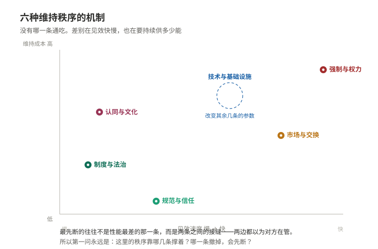

# 12 人如何一起做事

> **一句话**：素不相识的人能形成稳定秩序，既不是因为有谁在下命令，也不是因为人天生善良，而是因为好几条各自有条件、各自会断的机制同时在撑着。

## 一、为什么值得知道

**几个能对上号的场面。**

**第一个场面：小区里换电梯。**

一栋楼的电梯该换了，报价几十万。业主群里两百多号人，大部分互相不认识，只知道对方住几零几。有人牵头收钱。于是问题来了：谁来管这笔钱？管钱的人跑了怎么办？一楼住户说我不坐电梯，为什么要出钱？有人拖着不交，你能怎么办？最后事情黄了，电梯继续响。

这件事里有意思的地方是：**没有一个人是坏人**。牵头的人未必想贪，不交钱的人也未必是骗子——他只是在算自己的账。秩序没有形成，不是道德问题，是条件问题。

**第二个场面：同一条规则，十个人管用，五百个人就废了。**

"有事直接说，别走流程"——十个人的团队里这是效率，因为每个人都知道别人手上有什么活，一嗓子就解决了。同一个规则搬到五百人的组织，就变成了互相插队、重复劳动、谁的活都没人认账。于是开始有周报、有审批、有排期表。老员工会说"以前多简单"。

不简单。是**人一多，每个人能看见的范围占整体的比例就塌下来了**。十人时你能看见谁在偷懒，五百人时你只能看见自己那一格。

**第三个场面：匿名的时候像换了个人。**

同一个论坛，实名板块里人人客气，匿名板块里三天两头骂起来。同一个人、同一个话题、同一台电脑，只是换了一个"是否署名"的开关。

差别不在教养，在于**匿名把这一次交往的未来切掉了**：骂完不用再见面，那么"下次还打交道"这个约束就没了。人的行为不是随品格变化，是随**这次互动的后续**变化。

**第四个场面：越是公开透明，越可能出事。**

一家银行被传"快撑不住了"。监管出来说：我们的资产是充足的，账面数据全部公开。结果呢——挤兑反而更快了。原因不难理解：银行的钱大部分是放出去的长期贷款，短期拿不回来，而存款是可以随时取的。公布"资产充足"这句话本身没错，但它**不能立刻变成现金**，而排在队伍前面的人只想一件事：我别是最后一个。

粮价上涨时也一样：媒体越是报道涨价，大家越是囤，囤了越是涨。这里不是有人撒谎，是**信息在传播过程中改变了被描述的东西**。

**第五个场面：出了事，没有人对整条链负责。**

一个产品出了问题，做研究的人说我只负责做出结果，做工程的人说我只负责放大，管质量的人说我只负责检测，销售的只说卖。每一环都合规，每一环都说"那不归我管"，而整条链上没有一个位置是"对最终结果负责"的。

**第六个场面：一群好人凑在一起做事，做着做着就散了。**

最初十几个人全凭热情：谁有空谁来，钱谁垫的都记不清，也没人计较。半年后要扩大规模，问题全冒出来——谁来决定钱怎么花？有人出了一百个小时，有人出了十个小时，怎么算？有人提议"我们别搞那些官僚的东西"，可是不搞就没法分清谁在为谁干活。

**散掉的原因不是热情消退了，而是规模一过某个点，"靠默契"这套东西的承载量就到顶了。** 早先那些没写下来的规则之所以没出问题，只是因为人少、大家互相看得见；这两个条件一撤，同样一群人、同样一份心意，就维持不住同一件事。

---

**为什么缺这个概念的人不会觉得自己缺。**

因为**秩序在正常运转的时候是隐形的**。

你走在马路上，没人指挥你，也没人撞你；你买东西，掏出的是几张纸或者手机里的一个数字，对方就愿意把东西给你；你排队，前面的人就往前走。这些事全都在"没有任何人下令"的情况下运行。它们太顺了，顺到你根本不觉得这里有个问题。

只有坏掉的时候你才看见它。而坏掉的时候，人最容易抓到的解释是**人**：找个人出来负责，说一句"人心不古"或者"都是那个人太贪"，心里就舒服了。这个解释很省事，但是它什么也修不好——因为换一个人进来，同样的结构还会再坏一次。

真正要看的是：**这个局面里，谁在什么时候有什么理由不配合，以及有什么东西在拦着他。**

还有一层更隐蔽的：**缺这个概念的人，往往会把"结构问题"读成"人品问题"，而人品解释是自我验证的**。他认定问题是坏人造成的，于是换掉那些人；新上来的还是同样条件下的人，于是同样的剧情重演；他就得出结论"人都是这样"。这个循环看起来像阅历，其实是从没换过问法。

而这些机制在顺利运行时都藏得极深。你从没想过"手机里的数字为什么能换东西"，也从不追问"电梯里的规矩是谁定的"。**一门机制越是好用，它就越不被意识到**——于是人也越不容易想到，它其实是需要被维护的。

**这一篇的承诺句。**

> 知道这件事之后，你遇到任何一条规则、一个组织、一次合作，会**先问"这个秩序靠什么维持"，再问它好不好**。

问反了就会一直做无用功：反复讨论"这样公不公平"，却从不检查它靠什么在运行、哪一根柱子一撤它就塌。

---

## 二、它究竟是什么

### 2.1 先把问题问准：这不是道德说教

这个问题是：**互不相识、各怀私心的人，怎么能形成稳定的秩序？**

它之所以是真问题，是因为局面的结构长这样：**每个人单独做的选择都是合理的，合起来的结果对所有人都不好。** 交钱修电梯，我不交省钱，别人交了我照样坐；结果是钱收不齐，大家都爬楼。这条路不是"有人学坏了"，而是**每个人的理性叠起来变成了集体的蠢**。

1651 年霍布斯在《利维坦》里把这个局面推到极端：没有共同权力时，人人自保，结果是人人不安。1968 年哈丁把同类结构写成"公地悲剧"：一块人人都能用的草场，人人都多放一头牛，最后草场废掉。1965 年奥尔森在《集体行动的逻辑》里指出更尖锐的一点：**受益的人越多，每个人出力的动力越弱**，因为受益是大家分，成本是自己扛。

关键在于：**这些局面成立与否，取决于条件，而不取决于人的品格。** 同一群人，换一组条件，行为就变。所以后面每一条路，都要连着它的条件一起看。

**边界**：这个"困境"本身也有不成立的时候。如果交往是重复的、每个人都能被认出来、退出有代价、人数不多，那么合作的动力会自己长出来，不一定需要外部机制。**一旦这几条有一半对不上，"只能靠道德自觉"这种悲观判断就是错的；反过来，条件全对不上时，"靠大家自觉"这种乐观判断就是错的。**

再补一个常被漏掉的形状：**"搭便车"和"供不上"是两回事，但后果一样**。前者是有人享受了却不付成本（我用了别人修好的路，自己没出力）；后者是明明所有人都想要，却没有一个人先动手（大家都觉得该有人先来）。前者的解药通常是"能不能看见谁没出力"，后者的解药通常是"有没有人先承担前期成本"。**用错解药，问题会一直在。**

### 2.2 第一条路：强制与权力

**做法**：把执行能力集中到一个位置，不配合就惩罚。

**为什么快**：它不需要说服任何人，只需要让每个人知道"不做有后果"。危机时刻、异质性极高的场合（语言不通、彼此毫无信任），这是唯一能在很短时间内让事情动起来的机制。韦伯对现代国家的一个界定就是：它主张在特定领土内**垄断合法的暴力**。

**它的收益是有真东西的**：奥尔森在《独裁、民主与发展》里提出过一个"定居匪帮"的说法——一个只抢一次的匪帮会把你抢光；一个打算长期盘踞的匪帮反而会修路、护商，因为这片地以后还要收税。稳定的强制**可能**提供秩序，这是它在历史上反复被选中的原因。

**崩溃点一：谁来看管看管者。** 这一问古罗马诗人尤维纳利斯就写过了（"看守者自己由谁看守"）。给管人的人再派一个管的人，那个管的人又由谁管——**这是一个无穷倒退，它不是修辞，是结构上真实存在的漏洞**。任何强制体系最终都要在某处停下，而停下的那个位置，就是整个体系的单点。

这个漏洞在历史上有过非常难看的实例。公元 193 年，罗马的禁卫军——本来是皇帝的卫队——在皇帝被杀之后**公开把帝位拿出来卖**，价高者得，一位叫尤利安努斯的元老买下了它。看管者一旦发现自己的力量可以反过来用，它就不再是秩序的保障，而成了秩序的价格。同样的结构在明代反复上演：为了监督官员设了锦衣卫，为了监督锦衣卫设了东厂，为了监督东厂又设了内厂，**每一层新设的监督者都成了下一个需要被监督的对象**，而每一次增设都让成本更高、也离"谁来管最上面那个"更远。

**这里的教训不是"强制一定会腐败"，而是：链条必须有终点，而终点只能靠强制以外的东西来约束**——习惯、认同、或者某个比它更强的外部力量。一旦全靠强制自身合拢，那个终点就是最薄的一环。

**崩溃点二：强制需要信息，而信息是分散的。** 1945 年哈耶克在《知识在社会中的运用》里指出：一个社会的具体知识（谁缺什么、哪块地该怎么种、哪台机器该修）从不集中在任何一个人手里。集中决策者拿不到它，只能靠简化指标来决策，于是指标以外的部分就一起被牺牲掉。这不是能力问题，是**信息在物理上就不在那个位置**。

**边界**：强制在处理**明确、紧急、需要立刻统一行动**的事情上最强；在处理**需要本地知识、需要试错、需要创造性**的事情上最差，而且越努力越糟。

### 2.3 第二条路：市场与交换

**做法**：不统一命令，让每个人自己去交换。分工，然后用价格把分散的意愿连起来。

**为什么有效**：1776 年斯密在《国富论》里讲了两件事。一是分工极大提高产出；二是分工的深度**受市场范围的限制**——没人买，你就不可能专门去做那一件事。价格在这里起的作用不是"钱"，而是**压缩过的信息**：一样东西缺了，价格就上去，不需要谁去通知所有人。

**它的前提常常被忘掉**：市场不是自然状态，是很贵的设施。它至少需要——**可执行的产权**（这东西是我的，说了算）、**契约能被兑现**（签了约不算数，交换就退化成人盯人的即时交易）、**货币**、**竞争者足够多**、**参与者能退出**。这些条件缺一个，交换就变形。

**崩溃点一：无法定价的东西。** 干净的空气、安静的夜晚、一段信任，都没有价格，于是"谁都可以用、谁都不付费"，最后被用光。这就是外部性。庇古在 20 世纪初就把这套分析做出来了：私人账和市场账不是一回事。

**崩溃点二：信息不对称。** 1970 年阿克洛夫写过"柠檬市场"：二手车卖家知道车况，买家不知道。买家只肯出平均价，好车退出市场，剩下的更差，价格再降——**市场自己把好东西赶出去了**。保险、信贷、招聘里到处是这个结构。

**崩溃点三：有些东西一旦被标价就变了。** 桑德尔在《金钱不能买什么》里举了一串例子：给献血的人付钱，献血量反而下降，因为"我在做好事"被换成了"我在挣二十块钱"。这类东西不是价格定错了，是**定价这个动作本身改变了它**。

**契约又是从哪来的**：契约不会自己生效，背后总得有人或有个机制让它生效。中世纪跨地区的商人不靠当地法庭（那是领主的，对陌生人未必公道），而是自己长出了一套"商人法"：谁赖账，整个商人圈子一起抵制他，所有人都不再和他做生意。这套东西之所以管用，是因为**惩罚由整个网络来执行，成本被分摊了**。它也解释了同一件事的另一面：这套机制只对"还想在这个圈子里做生意的人"有效——一个打算干完这票就走的人，根本不怕被圈子抵制。

**边界**：市场在"私人所有、可定价、可竞争、有退出"的场合表现最好，这是它无可替代的地盘；**对不可定价、外部性重、信息严重不对称的事情，它会稳定地失灵，不是偶尔失灵**。

### 2.4 第三条路：规范、道德与信任

**做法**：不靠惩罚，靠"这样做不像话"。靠人与人之间的往来记录。

**为什么最省成本**：它不需要警察、不需要合同、不需要律师。一个眼神就能解决的事，成本接近于零。

**它不是空想，有实验支撑**。1984 年阿克塞尔罗德组织了重复囚徒困境的计算机竞赛，让各种策略互相对打，结果胜出的策略简单得出奇——**先合作，然后对方怎么做我就怎么做**（以牙还牙）。它的好成绩来自两条：不主动占便宜，以及**被占便宜立刻还手**，于是"欺负我"这件事没有收益。

**它也不是只有理论**。1990 年奥斯特罗姆在《公共事物的治理之道》里整理了瑞士高山草场、日本村庄山林、西班牙和菲律宾的灌溉系统等一批**长期自我管理而没有崩溃**的公共资源案例，说明在特定条件下，使用者自己就能定规矩、自己监督、自己罚。她因为这些工作获得了 2009 年的诺贝尔经济学奖。这一点很重要：**"没有外部强制就一定完蛋"是错的**。

再补一个更细的对照。经济史家格雷夫研究过 11 世纪地中海两群商人：一群是马格里布商人，靠同一族群内部的**集体惩罚**——谁骗了人，全体成员一起断绝往来；另一群是热那亚商人，逐步转向**由个人承担责任、由第三方执行的法律制度**。在小而同质的圈子里，前者的成本极低、运转良好；而当交易对象扩展到不同信仰、不同族群、彼此不会再见面的陌生人时，集体惩罚就抓不住人了，后者才顶上来。**这不是谁更先进，是两套机制各自的有效范围不同**——圈子变了，就得换用具。

**它的条件很硬**：边界清楚（谁的份是谁的）、交往重复（以后还得见）、行为可观测（干坏事会被看见）、小规模、退出代价高。这几条不是加分项，是必需的。

**崩溃点：熟人半径之外直接失效。** 一旦对方是陌生人、很可能这辈子只打一次交道，那么"下次他不理我"这个惩罚就不存在了——**声誉机制在一次性交往中完全失效**。这就是为什么匿名环境里行为会变，也是为什么一个村庄的规矩搬到城市就没了。

另外两个：**流动性会拆掉它**（能搬走的人不在乎名声）；**声誉可以被刷**（评价可以买、可以删）。

**边界**：规范与信任在**小而稳定、反复打交道、彼此看得见**的共同体里最有效，成本最低；一旦规模超出可见范围，或者交往变成一次性，就必须换成制度或市场来接手——**继续靠它，就是拿最脆的方式扛最重的活**。

### 2.5 第四条路：制度与法治

**做法**：把规则放在结果之前。不问你这次做得对不对，先问你有没有按规则来。

**为什么值得付这个代价**：因为它买来的是**可预期性**。可预期性本身就是巨大的生产力：你敢投资一个十年后才回本的东西，前提是你能大致知道十年后那个东西还是你的。这套东西在历史上是被一点点打出来的——1215 年的《大宪章》把王权第一次放到文字约束之下；1689 年的《权利法案》、1701 年的《王位继承法》把法官的独立性固定下来；1787 年的美国宪法把权力拆成三份，麦迪逊在《联邦党人第 51 篇》里说得直接：如果人都是天使，就不需要任何政府了。

**它的条件**：要有独立到能判自己人的裁判者，要有能执行的产权，要有识字、记录、档案这些看起来不像政治的东西（下一节会回到这里），还要有对**规则本身**的共识。

**崩溃点一：僵化。** 规则是针对已知类型的问题写下来的。新情况出现时，规则要么套不上，要么套上去很荒唐，而修改规则本身要走流程。**规则越完备，修改它越贵。**

**崩溃点二：执行成本可能超过收益。** 什么事都走一遍程序，那程序本身会吃掉它想保护的东西。小额纠纷打三年官司，等于告诉所有人别来了。

**崩溃点三：被俘获。** 管行业的人由行业供养、由行业出人，规则就会往行业那边偏。形式上都合法——这正是它难发现的原因。

这里还有一层不那么显眼的困难：**规则的形式本身会改变结果**。同样一件事，写成一条抽象条文交给法官去套，和交给一批人按先例去比，产出的确定性完全不同。前者看起来更可预期，但条文总要解释，解释的余地就是不确定性的入口；后者看起来更贴近具体情形，但"下一个案子会怎么判"变得更难预判。**没有一种写法能同时把确定性和适应性拉满**，选择哪一种，本质上是在两种不确定性之间选。

富勒在《法律的道德性》里列过法律要成为法律必须满足的几条内在要求（公开、不溯及既往、可遵守、稳定、官方行为与公布规则一致等）。这套清单的用法不是赞美，而是**当尺子**：拿它一量，就知道某套"依法办事"到底还差多少。

**边界**：制度擅长处理**已经出现过、能被归类**的冲突，这是它不可替代的地方；对**全新类型、需要快速试错**的问题反应最慢，此时要么靠行政裁量，要么靠别的手段先顶上，等类型稳定了再补规则。

### 2.6 第五条路：认同与文化

**做法**：让人觉得"我们是一伙的"。不问值不值，问"这是我们该做的事"。

**为什么最持久**：它不靠监督，因为监督已经装进人的自我认识里了。安德森在《想象的共同体》里指出，现代民族是一种被想象出来的共同体——绝大多数同胞你一辈子不会见到，但你仍然把他们当"我们"。它能被建立，说明它靠的是**共同的语言、共同的记忆、被反复讲述的故事**，而不是血缘。

涂尔干在《社会分工论》里区分过两种黏合：小共同体靠"大家都很像"（机械团结），大社会靠"大家互不相同但离不开彼此"（有机团结）。**从前者到后者，是协作方式的一次根本换挡**：前者靠相似，后者靠互补与依赖。

韦伯在 1905 年的《新教伦理与资本主义精神》里提出过一个至今仍在被争论的解释：某些宗教观念把日常劳作本身变成了一种义务，于是"持续地、系统地挣钱但不花掉"这件事从道德上被允许甚至被鼓励，而这恰好是长期资本积累需要的态度。**这个解释有争议**（后来的研究者指出同一时期其他地区也有类似的积累，因果关系未必是那个方向），但它提出的问题是真的：**一种能支撑长期协作的态度，往往需要一套关于"什么是有意义的生活"的现成答案**，而这样的答案不能靠临时动员生产出来。

**崩溃点一：它可以被操纵。** 认同的原料——共同语言、共同记忆、共同敌人——都是可以被设计和放大的。它是这套机制里**唯一一个可以被人为快速制造出来的**，因此也最容易被拿去干坏事。15 世纪中叶印刷术普及之后，传单和宣传小册子成了最早的大规模舆论工具；此后每一次媒介换代，都先被用来制造认同，再被用来制造对立。

**崩溃点二：跨国认同最脆弱的一次考验**。1914 年之前，很多人相信各国工人不会互相开枪；战争一开，动员靠的正是民族认同，跨国的那一层几乎当场碎掉。这说明**认同的强度是有优先级的，读起来更抽象的那一层会在压力下先让路**。

**崩溃点三：圈子内的团结常常由圈子外的敌意买单。** 认同的边界一旦画实，对内越紧，对外越硬。

**边界**：认同解决的是"**愿不愿意**"的问题，解决不了"**能不能**"的问题。一群人再同心，没有记录、没有分配规则、没有执行手段，事情也做不成。

### 2.7 第六条路：技术与基础设施（最被低估的一条）

**这一条常被跳过去，但协作的规模上限，往往是由它定的。**

**货币**：公元前 7 世纪前后，吕底亚开始铸币。更早的美索不达米亚已经在泥板上记账。货币真正的功能不是"财富"，而是**把"我欠你一个人情"这种只能靠记忆维持的东西，变成可以携带、可以转让、可以交给第三方的凭证**。人情只能在熟人之间流通，货币可以跨陌生人流通。

**文字**：约公元前 3200 年，两河流域的楔形文字最早一批用途是**记账和盘点**，不是写诗。这件事不浪漫但极关键：**没有记录手段，一个组织的记忆只能寄存在人的脑子里**，人一走，记忆就没了，组织就散。官僚制、税收、法律、契约，全都长在"能写下并保存"这个能力上。

**度量衡**：公元前 221 年秦统一度量衡。1875 年的《米制公约》建立了国际度量衡局。原因很朴素：**尺子不一样，就没法签一份异地可执行的合同**。交易前的第一步不是谈判，是对齐单位。

**交通与时间**：铁路出现后，各地的地方时让列车时刻表无法协调——两站之间的时间对不上，撞车就是必然。1883 年北美划分标准时区，是为了让铁路能运行。**这是技术反过来重排社会规则的典型案例**：为了让交通协作，全社会的计时方式被改掉了。

**通信**：1844 年莫尔斯电报、1866 年跨大西洋电缆（此后洲际消息从数周变成分钟）、1901 年跨大西洋无线电，再到 1969 年的分组交换网络与 1991 年之后的万维网。每一次通信提速，都扩大了"可以实时协调"的范围：从一条街，到一个国家，到全球。

**读写能力**：这一条容易被漏掉，因为它是所有记录手段的**用户前提**。文书、合同、公告、账本，写下来了还得有人读得懂。历史上识字率长期极低，**这就意味着一整套靠文字运行的秩序，实际上只能覆盖极少一部分人**；口头传统与熟人网络承担了其余的全部。印刷术降低了文本的复制成本，识字率上升又反过来让制度、法律、市场这些"靠文字运行"的机制能够扩展到更大的范围。**这套循环里没有哪一步是自然发生的**：写、复制、读、执行，缺一环，规模就上不去。

**规模上限的量级**：人类学上有一个常被引用的估计——一个人能维持稳定互认关系的人数大约在 150 人量级（1992 年提出，具体数字有争议）。**这不是定理，是一个量级估计**：它提示了"靠面对面规范"能撑住的规模大概到哪里。超过这个量级还想要秩序，就得靠记录、层级、货币、通信来替代"认识"。

顺带说清一个常见误会：**技术不会自动带来秩序**。有文字的社会同样会崩，有铁路的国家同样会打内战。技术提供的是**可用的手段**，是否用它、怎么用它，取决于前面那五条怎么搭配。

**边界（这条最要紧）**：技术扩大上限，但**不决定用途**。电报既可以让总部实时指挥分散的部队，也可以让分散的网点实时协调；互联网既支持大规模自发协作，也支持大规模监控和谣言扩散。而且技术改变的不只是上限，也改变了崩溃的方式——**假消息的传播速度也一起提高了**。

### 2.8 学科把这个问题的哪一段切走、又留下了什么

把上面六条摆在一起会发现：它们**不属于同一个部门**。

- 强制与权力，落在政治这一支。
- 市场与价格，落在经济这一支。
- 规范与信任，落在社会心理这一支（1961 年米尔格拉姆的服从实验、1951 年阿希的从众实验，研究的都是"人在他人面前怎么改变行为"）。
- 制度与法治，落在法理与历史这一支。
- 认同与文化，落在人类学与历史这一支。
- 技术与基础设施，通常被划给技术史或工程，**而它恰恰是决定其余几条能不能放大的那一环**。

问题就出在这里：**每一段都有人研究得很细，但没有任何一个位置对整条链负责**。做价格研究的人不负责契约执行的成本，做契约的人不负责识字率，做识字率的人不负责铁路，做铁路的人不负责认同。于是当一件事真的失败时，往往查不出是哪一门的错——**因为错在接口处，而接口是分科时被切掉的，没有人认领**。

这不是在说分工不好。分工让每一段都深了，代价就是**接头的地方没人管**。前面讲组织时那句"没有人对整条链负责"，在这里是同一个道理，只是换了一个尺度：**它不只是某个单位的毛病，也是整个知识分科方式的固有代价**。

韦伯一个人横跨了宗教、经济、法律与支配形式，这本身说明这个问题原本是连着的；而后来它被切成了几块，各自长出了自己的术语和评价标准。

接口失效的形状都差不多：**每一段都按自己的指标做到了最优，合起来却变差**。做价格研究的把价格调顺了，代价落在没被计价的环节；做执行的把违约率压下去了，代价是没人敢签新合同；做认同的把队伍凝聚起来了，代价是对外的合作断了。**没有哪一段的数据会显示问题**，因为问题只在两段之间。这就是为什么这类失败往往不是被解决的，而是等到它大到无法忽视时才被承认。

### 2.9 逐条列出它们的崩溃条件

上面每一条都写了边界，这里收拢成一张单子。**判断一个秩序稳不稳，就是拿这张单子去对**：

| 靠什么维持 | 什么时候它最强 | 什么时候它会断 |
|---|---|---|
| 强制与权力 | 紧急、明确、需要立刻统一行动 | 看管者无人约束；需要分散的本地知识；**强制机构自身的维持成本** |
| 市场与交换 | 私人所有、可定价、可竞争、能退出 | 不可定价之物、外部性、信息严重不对称、只有少数参与者 |
| 规范与信任 | 小而稳、反复交往、彼此看得见 | **一次性交往（声誉完全失效）**、超出熟人半径、人口高度流动、声誉可被刷 |
| 制度与法治 | 冲突类型已知、需要长期可预期 | 规则滞后于现实、执行成本超过收益、被利益方俘获、只讲形式不讲目的 |
| 认同与文化 | 需要人自愿多做一点的时候 | 被操纵、圈层排他、更高的跨国认同在压力下让位 |
| 技术与基础设施 | 扩大可协调的范围与规模上限 | 它只决定上限、不决定用途；也同时放大了谣言与监控 |

另外补一条**时间尺度**上的差异，它决定了这几条怎么搭配：**强制见效最快但需要持续供能；市场反应快但看不到长期外部性；规范见效慢但几乎不耗能；制度见效最慢但一次建成能用很久；认同最慢、最持久、也最容易被劫持；技术改变的是前面所有条的参数**。

还有一件按这张单子才能做的事：**找出最薄的那一环**。实战里最先断的往往不是性能最差的那条，而是**两条之间的接缝**——名义上有两套机制覆盖，实际上两边都以为对方在管。比如一个集体既有"大家都是熟人"的默契，又有一套"按章程来"的条文，表面上看双保险；一旦来了新人（熟人圈不认他）而章程又没写清这种情形（条文套不上），两边同时落空。**重叠区看起来最安全，实际上经常最空。**

这也是为什么"加强管理"这种说法几乎没有信息量：**不说清是加哪一条、补哪个缝，加进去的东西只会堆在本来就厚的地方**。

还有一个必须点出的动态：**反馈一旦有延迟，系统就会震荡而不是稳定**。肉价高，大家多养，一年后猪出栏时供过于求，价格崩，大家又不养，再过一年又缺。这里没有人犯错，**错在延迟**。银行挤兑、抢购囤货也是同一个形状：信息传得快，而实体调整得慢，中间那段时差就是恐慌的温床。**所以"把信息全部公开"不是万能的，它要和调整速度匹配；不匹配时，透明本身就是放大器。**

### 2.10 收束

这一板块最核心的一个想法是：

> **秩序不是从善意里长出来的，也不是从某个中心颁布下来的。它是好几条各自有条件、各自会断的机制并行撑着的结果。**

这带来一个很实际的态度转变。看到一条规则、一个组织、一次合作，先别问"这个好不好"——公不公平、高不高效，这些是第二问。第一问永远是：

**这里的秩序现在靠哪几条撑着？哪一条一旦撤掉，会先断？**

问出这一句，很多看起来莫名其妙的失败，就变成了可以指认的结构问题：不是因为人心变坏了，而是因为撑着它的那一根，本来就有个明确的断点。

---

**配套：** [边界清单](../边界清单.md) —— 这一篇里每条结论的成立条件与失效条件，都在那一页。

**导航：** [← 上一个 · 如何在不确定中判断](11-如何在不确定中判断.md) ｜ [↑ 总说](../00-总说.md) ｜ [下一个 · 边界清单（全书失效条件汇总）→](../边界清单.md)
